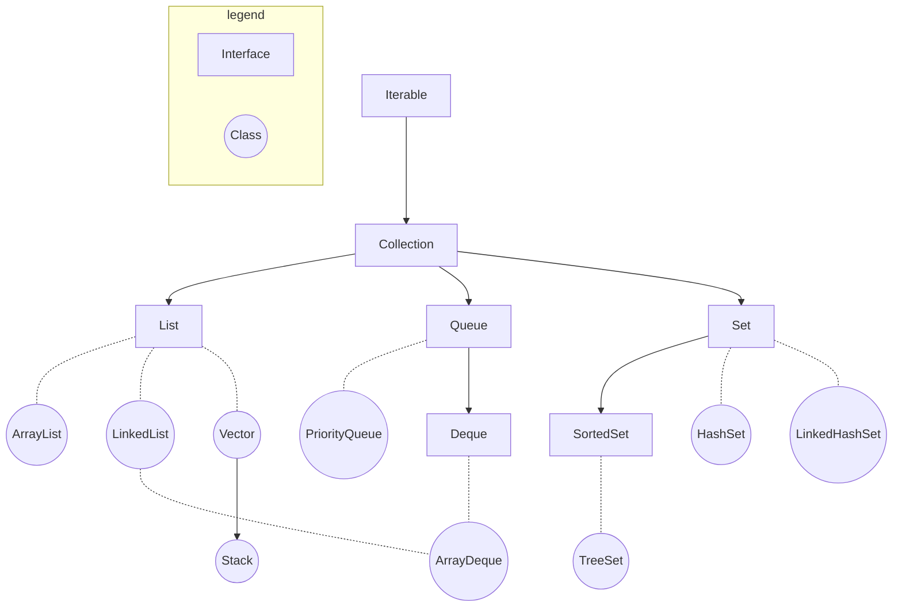
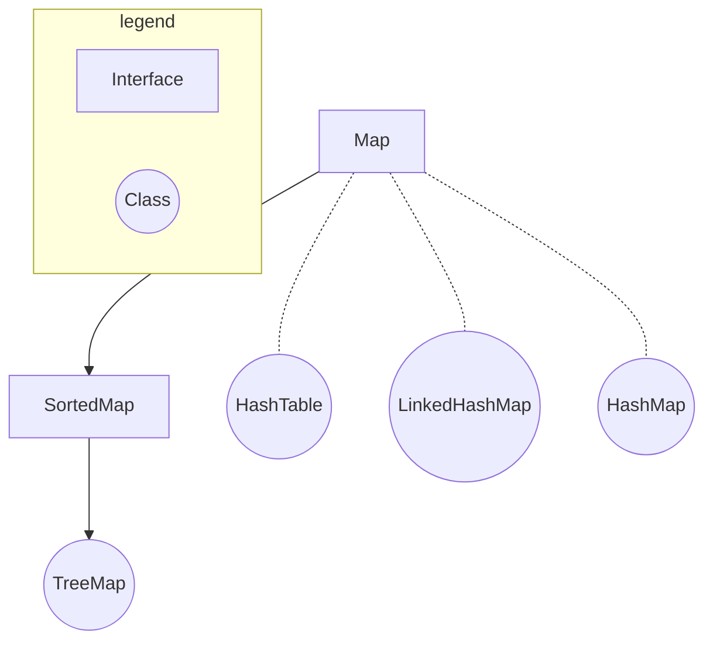

在后续文中所有的示例代码都以引入了`java.util`包为前提，即：
```java
import java.util.*;
```

# 整体框架
Java的集合框架分为两个体系：
- 基于**Collection接口**。Collection接口继承自Iterable接口，这说明其子类均可以实现**遍历操作**。

- 基于**Map接口**。子类均可以实现**键值对操作**，键不可重复。


## Collection框架


## Map框架


# Collection
Collection接口包含三个子接口：
- [List](#list)
- [Queue](#queue)
- [Set](#set)

## List
特点：元素**有序**，**可重复**。包含以下几个常用的实现类：
- [ArrayList](#arraylist)
- [LinkedList](#linkedlist)
- [Vector](#vector)
- [Stack](#stack)

### ArrayList
- 基于数组实现
- 线程不安全
- **查找快**，**增删慢**

其与后续提到的链表（LinkedList）使用方法类似，区别在于ArrayList的查找与修改操作效率更高，适合**需要频繁访问或修改列表中某一元素**时使用。

#### 构造方法
```java
ArrayList<E> objectName = new ArrayList<>();
```

#### 常用方法
| 方法 | 描述 |
| --- | --- |
| `add(int index, E e)` | 将元素**插入**到指定索引处，默认为末尾 |
| `remove(int index)` <br> `remove(E e)` | **删除**指定索引处的元素 <br> **删除**指定元素|
| `get(int index)` | **查询**指定索引处的元素 |
| `set(int index, E e)` | **修改**指定索引处的元素 |
| `sort()` | 升序排序 |
| `size()` | 返回元素数量 |
| `subList(int start, int end)` | 返回指定子列表，**左闭右开** |

代码示例：
```java
import java.util.*;

public class arraylist {
    public static void main(String[] args){
        /* initialize */
        ArrayList<String> S = new ArrayList<>();
        String[] s = {"hello", "good", "bad", "happy", "art"};
        for (String element: s){
            S.add(element);
        }
        print("initialize", S);

        /* add */
        S.add("code");
        print("default add", S);
        S.add(0, "ok");
        print("add using index 0", S);

        /* remove */
        S.remove("hello");
        print("remove 'hello'", S);
        S.remove(3);
        print("remove using index 3", S);

        /* get */
        print("get index 2", S.get(2));

        /* set */
        S.set(3, "science");
        print("set", S);

        /* sort */
        S.sort(null);
        print("sort", S);

        /* size */
        print("size", S.size());

        /* subList */
        print("subList", S.subList(1, 4));
    }

    public static void print(String prompt, ArrayList<String> x){
        System.out.println(String.format("%-30s %-20s", prompt, " S = " + x));
    }

    public static void print(String prompt, String x){
        System.out.println(String.format("%-30s %-20s", prompt, " string = " + x));
    }

    public static void print(String prompt, int x){
        System.out.println(String.format("%-30s %-20s", prompt, " size = " + x));
    }
    
    public static void print(String prompt, List<String> x){
        System.out.println(String.format("%-30s %-20s", prompt, " sublist = " + x));
    }
}
```
输出：
```
initialize                      S = [hello, good, bad, happy, art]
default add                     S = [hello, good, bad, happy, art, code]
add using index 0               S = [ok, hello, good, bad, happy, art, code]
remove 'hello'                  S = [ok, good, bad, happy, art, code]
remove using index 3            S = [ok, good, bad, art, code]
get index 2                     string = bad       
set                             S = [ok, good, bad, science, code]
sort                            S = [bad, code, good, ok, science]
size                            size = 5           
subList                         sublist = [code, good, ok]
```

### LinkedList
- 基于链表实现
- 线程不安全
- **查找慢**，**增删快**

链表（LinkedList）由**节点**组成，每一个节点中存储该节点的值与相邻（根据不同情况）节点的地址。链表分为以下两类：
- **单向链表**，包含：
  - 当前节点的值
  - 下一个节点的地址
- **双向链表**，包含：
  - 当前节点的值
  - 下一个节点的地址
  - 上一个节点的地址

其使用方法与ArrayList类似，只不过链表的增删操作效率更高，而查找与修改的操作效率较低。所以当需要**频繁地在列表中进行增删操作**时使用链表更合适。

#### 构造方法
- 普通初始化
    ```java
    LinkedList<E> list = new LinkedList<>();
    ```
- 使用其他集合创建
    ```java
    LinkedList<E> list = new LinkedList<>(Collection<E> c);
    ```
    例：
    ```java
    import java.util.*;

    public class linkedlist {
        public static void main(String[] args){ 
            ArrayList<Integer> nums = createArrayList(1, 2, 3, 4, 5);
            LinkedList<Integer> list2 = new LinkedList<>(nums);
            print("initialization with other collections", list2);
        }

        public static ArrayList<Integer> createArrayList(Integer... nums){
            ArrayList<Integer> res = new ArrayList<>();
            res.addAll(Arrays.asList(nums));
            return res;
        }

        public static void print(String prompt, LinkedList<Integer> list){
            System.out.println(String.format("%-50s %-30s", prompt, "list = " + list));
        }
    }
    ```
    输出：
    ```
    initialization with other collections              list = [1, 2, 3, 4, 5]
    ```

#### 常用方法
| 方法 | 描述 |
| --- | --- |
| `add(E e)` <br> `add(int index, E e)` | 向链表**末尾**添加元素，添加成功返回`true`，反之返回`false` <br> 向**指定位置**添加元素，**无返回值**，出错**会抛出异常** |
| `addFirst(E e)` <br> `addLast(E e)` | 将指定元素添加至链表头部，**无返回值**，出错**会抛出异常** <br> 将指定元素添加至链表尾部，**无返回值**，出错**会抛出异常** |
| `remove(Object o)` <br> `remove(int index)` | 删除指定元素，删除成功返回`true`，反之返回`false` <br> 删除指定位置元素**并返回**，出错**会抛出异常** |
| `removeFirst()` <br> `removeLast()` | 删除**并返回**第一个元素，出错**会抛出异常** <br> 删除**并返回**最后一个元素，出错**会抛出异常** |
| `get(int index)` <br> `getFirst()` <br> `getLast()` | 获取指定位置元素，出错**会抛出异常** <br> 获取链表第一个元素，出错**会抛出异常** <br> 获取链表最后一个元素，出错**会抛出异常** |
| `set(int index, E e)` | 将指定位置元素替换 |
| `size()` | 返回链表元素个数 |

代码示例：
```java
/* add */
list2.add(5, 6);
print("add", list2);
list2.addFirst(0);
print("add first 0", list2);
list2.addLast(7);
print("add last 7", list2);

/* remove */
list2.remove(2);
print("remove element in index 2", list2);
list2.removeFirst();
print("remove first", list2);
list2.removeLast();
print("remove last", list2);

/* get */
print("get index 3", list2.get(3));
print("get first", list2.getFirst());
print("get last", list2.getLast());

/* set */
list2.set(2, 10);
print("set element in index 2 to 10", list2);

/* size */
print("size of list", list2.size());
```
输出：
```
add                                                list = [1, 2, 3, 4, 5, 6]     
add first 0                                        list = [0, 1, 2, 3, 4, 5, 6]  
add last 7                                         list = [0, 1, 2, 3, 4, 5, 6, 7]
remove element in index 2                          list = [0, 1, 3, 4, 5, 6, 7]  
remove first                                       list = [1, 3, 4, 5, 6, 7]     
remove last                                        list = [1, 3, 4, 5, 6]        
get index 3                                        num = 5                       
get first                                          num = 1                       
get last                                           num = 6                       
set element in index 2 to 10                       list = [1, 3, 10, 5, 6]       
size of list                                       num = 5  
```


### Vector
- 基于数组实现
- 线程安全
- 属于遗留类，不常用（常用ArrayList）

#### 构造方法
支持四种构造方法：
- 创建一个默认的向量，默认容量为**10**
    ```java
    Vector<Integer> v1 = new Vector<>();
    System.out.println("v1 capacity: " + v1.capacity());
    ```
    输出：
    ```
    v1 capacity: 10
    ```
- 创建一个指定容量的向量
    ```java
    Vector<Integer> v2 = new Vector<>(20);
    System.out.println("v2 capacity: " + v2.capacity());
    ```
    输出：
    ```
    v2 capacity: 20
    ```
- 创建一个指定容量和**增量**的向量，增量指的是当数组容量不足时自动补足的容量大小
    ```java
    Vector<Integer> v3 = new Vector<>(2, 3);
    for (int i = 0; i < 6; i++){
        v3.add(1);
        System.out.println("i = " + i + "\t\tv3 capacity: " + v3.capacity());
    }
    ```
    输出：
    ```
    i = 0		v3 capacity: 2
    i = 1		v3 capacity: 2
    i = 2		v3 capacity: 5
    i = 3		v3 capacity: 5
    i = 4		v3 capacity: 5
    i = 5		v3 capacity: 8
    ```
- 创建一个包含某个集合中所有元素的向量
    ```java
    ArrayList<Integer> nums = new ArrayList<>(3);
    nums.add(1);
    nums.add(2);
    Vector<Integer> v = new Vector<>(nums);
    System.out.println("v = " + v);
    ``` 
    输出：
    ```
    v = [1, 2]
    ```

#### 常用方法
| 方法 | 描述 |
|---|---|
| `add(int index, E e)` | 向指定位置插入指定元素 |
| `add(E e)` | 将指定元素添加至向量末尾 |
| `capacity()` | 返回向量的当前容量 |
| `contains(E e)` | 判断向量是否包含指定元素 |
| `get(int index)` | 返回指定索引处的元素，与`` |
| `equals(Object o)` | 比较指定对象是否与此向量相等 |
| `remove(int index)` | 移除向量中指定索引的元素 |
| `subList(int start, int end)` | 返回指定索引区间（**左闭右开**）的元素 |

代码示例：
```java
import java.util.*;

public class vector{
    public static void main(String[] args){
        /* add */
        Vector<Integer> v4 = new Vector<>();
        for (int i = 0; i < 8; i++){
            v4.add(i);
        }
        System.out.println(String.format("%-60s %10s", "v4 = " + v4, "capacity = " + v4.capacity()));
        
        /* add with index */
        for (int i = 0; i < 5; i++){
            v4.add(1, 100);
            System.out.println(String.format("%-60s %10s", "v4 = " + v4, "capacity = " + v4.capacity()));
        }
        
        /* contains */
        System.out.println("v4 contains 98: " + v4.contains(98));
        System.out.println("v4 contains 1: " + v4.contains(1));

        /* get */
        System.out.println("v4[2] = " + v4.get(2));

        /* remove */
        for (int i = 0; i < 6; i++){
            v4.remove(0);
        }
        System.out.println("v4 = " + v4);

        /* subList */
        System.out.println("v4[2:6] = " + v4.subList(2, 6));
    }
}
```
输出:
```
v4 = [0, 1, 2, 3, 4, 5, 6, 7]                                capacity = 10
v4 = [0, 100, 1, 2, 3, 4, 5, 6, 7]                           capacity = 10
v4 = [0, 100, 100, 1, 2, 3, 4, 5, 6, 7]                      capacity = 10
v4 = [0, 100, 100, 100, 1, 2, 3, 4, 5, 6, 7]                 capacity = 20
v4 = [0, 100, 100, 100, 100, 1, 2, 3, 4, 5, 6, 7]            capacity = 20
v4 = [0, 100, 100, 100, 100, 100, 1, 2, 3, 4, 5, 6, 7]       capacity = 20
v4 contains 98: false
v4 contains 1: true
v4[2] = 100
v4 = [1, 2, 3, 4, 5, 6, 7]
v4[2:6] = [3, 4, 5, 6]
```

### Stack
Stack是**Vector类的子类**，实现了后进先出的栈。其包括了Vector类中定义的所有方法，也定义了一些自己独有的方法，总结如下：
| 方法 | 描述 |
| --- | --- |
| `empty()` | 判断栈是否为空 |
| `peek()` | 查看栈顶对象，**不移除** |
| `pop()` | 弹出栈顶对象并返回 |
| `push(E e)` | 将对象入栈 |
| `search(E e)` | 返回指定元素在栈中的位置，**以1为索引起点** |

代码示例：
```java
import java.util.*;

public class stack {
    public static void main(String[] args){
        /* initialization */
        Stack<Integer> nums = new Stack<>();
        for (int i = 0; i < 10; i++){
            nums.add(i);
        }
        print("initialization", nums);

        /* empty */
        print("is empty", nums.empty());

        /* peek */
        print("peek", nums.peek());
        print("stack after peek", nums);

        /* pop */
        print("pop", nums.pop());
        print("stack after pop", nums);

        /* push */
        nums.push(10);
        print("stack after push", nums);

        /* search */
        print("the index of 5 in the stack", nums.search(5));
    }

    public static void print(String prompt, boolean is_empty){
        System.out.println(String.format("%-30s %-30s", prompt, is_empty));
    }

    public static void print(String prompt, Integer num){
        System.out.println(String.format("%-30s %-30s", prompt, num));
    }

    public static void print(String prompt, Stack<Integer> nums){
        System.out.println(String.format("%-30s %-30s", prompt, nums));
    }
}

```
输出:
```
initialization                 [0, 1, 2, 3, 4, 5, 6, 7, 8, 9]
is empty                       false                         
peek                           9                             
stack after peek               [0, 1, 2, 3, 4, 5, 6, 7, 8, 9]
pop                            9                             
stack after pop                [0, 1, 2, 3, 4, 5, 6, 7, 8]   
stack after push               [0, 1, 2, 3, 4, 5, 6, 7, 8, 10]
the index of 5 in the stack    5  
```

## Queue
特点：元素**有序**，**可重复**。包含以下几个常用的实现类：
- [PriorityQueue](#priorityqueue)
- [ArrayDeque](#arraydeque)
- [LinkedList](#linkedlist)

这里后两者都实现了Queue接口的子接口Deque，由于LinkedList类已在先前的文章中总结完毕，故在此处省略。

### PriorityQueue
- 基于二叉堆实现
- 按照入队元素的大小重新排序，最小的元素最先出队列（**最小堆**）
- 默认排序方式为**升序排序**
- 线程不安全

#### 构造方法
```java
PriorityQueue<E> nums = new PriorityQueue<>();
```

#### 常用方法
| 方法类型 | 具体方法 | 描述 |
| --- | --- | --- |
| 添加元素 | `add(E e)` <br> `offer(E e)`  | 向优先队列中添加元素，当队列已满会**抛异常** <br> 向优先队列中添加元素，当队列已满会**返回**`false` |
| 访问元素 | `element()` <br> `peek()` | 获取队头元素，队列为空时**抛异常** <br> 获取队头元素，队列为空时**返回**`null` |
| 删除元素 | `remove()` <br> `poll()` | 删除队头元素并返回，队列为空时**抛异常** <br> 删除队头元素并返回，队列为空时**返回**`null` |
| 其他 | `size()` <br> `contains(E e)` <br> `toArray()` | 返回队列长度 <br> 判断队列中是否包含指定元素 <br> 将队列转化为数组并返回 |

代码示例：
```java
import java.util.*;

public class priorityqueue{
    public static void main(String[] args){
        /* initialization */
        PriorityQueue<Integer> nums = new PriorityQueue<>();

        /* add, offer */
        for (int i = 10; i > 0; i--){
            nums.offer(i);
        }
        print("offer:", nums);
        nums.add(0);
        print("add:", nums);

        /* element, peek */
        print("element(default):", nums.element());
        print("peek(default):", nums.peek());

        /* remove, poll */
        print("remove:", nums.remove());
        print("poll:", nums.poll());

        /* size */
        print("size:", nums.size());

        /* contains */
        print("contains 7:", nums.contains(7));
        print("contains 100:", nums.contains(100));
    }

    public static void print(String prompt, PriorityQueue<Integer> nums){
        System.out.println(String.format("%-30s %-30s", prompt, nums));
    }

    public static void print(String prompt, Object num){
        System.out.println(String.format("%-30s %-30s", prompt, num));
    }

    public static void print(String prompt, boolean contain){
        System.out.println(String.format("%-30s %-30s", prompt, contain));
    }
}
```
输出：
```
offer:                         [1, 2, 5, 4, 3, 9, 6, 10, 7, 8]
add:                           [0, 1, 5, 4, 2, 9, 6, 10, 7, 8, 3]
element(default):              0                             
peek(default):                 0                             
remove:                        0                             
poll:                          1                             
size:                          9                             
contains 7:                    true                          
contains 100:                  false
```

#### 遍历方式
遍历队列的方式，使用迭代器Iterator：
```java
Iterator<Integer> iter = nums.iterator();
while (iter.hasNext()){
    print("iter:", iter.next());
}
```
输出：
```
iter:                          0                             
iter:                          1                             
iter:                          5                             
iter:                          4                             
iter:                          2                             
iter:                          9                             
iter:                          6                             
iter:                          10                            
iter:                          7                             
iter:                          8                             
iter:                          3
```

#### 比较器（Comparator）
通过使用Comparator，我们可以自定义队列中元素的排序方式。使用时需要创建自定义的比较器类，令其实现Comparator接口，示例如下：
```java
class CustomComparator implements Comparator<Integer>{
    @Override
    public int compare(Integer n1, Integer n2){
        if (n1 > n2){
            return -1;
        }
        else if (n1 == n2){
             return 0;
        }
        else{ 
            return 1;
        }
    }
}
```
这里看到通过Comparator接口实现的自定义类中存在一个`compare`方法，它的作用是用来定义参数的排序方式。更具体地说，这个方法返回一个具有三种可能性的值 **（正、负、零）**，分别代表第一个参数**大于、小于、等于**第二个参数。而这里可以看到当`n1 > n2`时返回负值，说明此时在这个自定义的比较器类中**正常情况下越大的整数会被识别为越小的值**，也即**倒序**排列。将这个自定义的排序方式应用到优先队列中的方式如下：
```java
PriorityQueue<Integer> nums = new PriorityQueue<>(new CustomComparator());
```
此时这个优先队列实际上成为了一个**最大堆**。最后看一下实现的效果：
```java
for (int i = 0; i < 10; i++){
    nums.offer(i);
}
System.out.println(String.format("%-10s %-10s", "nums:", nums));
```
输出：
```
nums:      [9, 8, 5, 6, 7, 1, 4, 0, 3, 2]
```

### ArrayDeque
- 基于数组实现
- **查找快，增删慢**
- 线程不安全
- 可以用作**栈**，效率高于Stack
- 可以用作**队列**，效率高于LinkedList

#### 构造方法
```java
ArrayDeque<Integer> nums = new ArrayDeque<>();
```

#### 常用方法
| 方法类型 | 具体方法 | 描述 | 是否抛异常 | 是否返回值 |
| --- | --- | --- | --- | --- | 
| 添加元素 | `add(E e)` <br> `addFirst(E e)` <br> `addLast(E e)` | 将指定元素添加至队尾 <br> 将指定元素添加至队头 <br> 将指定元素添加至队尾（与`add()`等效） | 是 | 否，添加失败时抛异常 |
| 添加元素 | `offer(E e)` <br> `offerFirst(E e)` <br> `offerLast(E e)` | 将指定元素添加至队尾 <br> 将指定元素添加至队头 <br> 将指定元素添加至队尾 | 否 | 是，添加失败则返回`false`反之`true` |
| 访问元素 | `getFirst()` <br> `getLast()` | 返回队头元素 <br> 返回队尾元素 | 是 | 是，队列为空时抛异常 |
| 访问元素 | `peek()` <br> `peekFirst()` <br> `peekLast()` | 返回队头元素 <br> 返回队头元素（与`peek()`等效） <br> 返回队尾元素 | 否 | 是，队列为空时返回`null` |
| 删除元素 | `remove()` <br> `removeFirst()` <br> `removeLast()` | 删除并返回队头元素 <br> 删除并返回队头元素（与`remove()`等效）<br> 删除并返回队尾元素 | 是 | 是，队列为空时抛异常 |
| 删除元素 | `poll()` <br> `pollFirst()` <br> `pollLast()` | 删除并返回队头元素 <br> 删除并返回队头元素（与`poll()`等效）<br> 删除并返回队尾元素 | 否 | 是，队列为空时返回`null` |

代码示例：
```java
import java.util.*;

public class arraydeque {
    public static void main(String[] args){
        /* initialization */
        ArrayDeque<Integer> nums = new ArrayDeque<>();
        nums.add(0);
        print("initial arrayqueue:", nums);
        System.out.println("");
        
        /* add */
        nums.add(1);
        print("add 1:", nums);
        nums.addFirst(2);
        print("addFirst 2:", nums);
        nums.addLast(3);
        print("addLast 3:", nums);
        System.out.println("");

        /* offer */
        nums.offer(4);
        print("offer 4:", nums);
        nums.offerFirst(5);
        print("offerFirst 5:", nums);
        nums.offerLast(6);
        print("offerLast 6:", nums);
        System.out.println("");

        /* get */
        print("getFirst:", nums.getFirst());
        print("getLast:", nums.getLast());
        System.out.println("");

        /* peek */
        print("peek:", nums.peek());
        print("peekFirst:", nums.peekFirst());
        print("peekLast:", nums.peekLast());
        System.out.println("");

        /* remove */
        print("remove:", nums.remove());
        print("removeFirst:", nums.removeFirst());
        print("removeLast:", nums.removeLast());
        System.out.println("");

        /* poll */
        print("poll:", nums.poll());
        print("pollFirst:", nums.pollFirst());
        print("pollLast:", nums.pollLast());
    }

    public static void print(String prompt, ArrayDeque<Integer> nums){
        System.out.println(String.format("%-20s %-30s", prompt, nums));
    }

    public static void print(String prompt, Integer num){
        System.out.println(String.format("%-20s %-30s", prompt, num));
    }
}
```
输出：
```
initial arrayqueue:  [0]                           

add 1:               [0, 1]                        
addFirst 2:          [2, 0, 1]                     
addLast 3:           [2, 0, 1, 3]                  

offer 4:             [2, 0, 1, 3, 4]               
offerFirst 5:        [5, 2, 0, 1, 3, 4]            
offerLast 6:         [5, 2, 0, 1, 3, 4, 6]         

getFirst:            5                             
getLast:             6                             

peek:                5                             
peekFirst:           5                             
peekLast:            6                             

remove:              5                             
removeFirst:         2                             
removeLast:          6                             

poll:                0                             
pollFirst:           1                             
pollLast:            4
```

#### 遍历方式
同样还是采用Iterator：
```java
Iterator<Integer> iter = nums.iterator();
while (iter.hasNext()){
    print("iter:", iter.next());
}
```
输出：
```
iter:                5                             
iter:                2                             
iter:                0                             
iter:                1                             
iter:                3                             
iter:                4                             
iter:                6
```

## Set
特点: 元素**无序**，**不可重复**。包含以下几个常用的实现类：
- [Hashset](#hashset)
- [LinkedHashSet](#linkedhashset)
- [Treeset](#treeset)

### Hashset
- 基于HashMap实现
- 线程不安全
- 元素**无序**，不依赖其添加至集合的顺序
- 允许null值

#### 构造方法
默认方法为：
```java
HashSet<E> nums = new HashSet<>();
```
也可以在构造时指定 **容量（capacity）** 和 **负载因子（loadFactor）**：
```java
Hashset<E> nums = new HashSet<>(8, 0.5);
```
这样创建的便是一个容量为8，负载因子为0.5的HashSet了。负载因子用于控制HashSet扩容的时机，例如这里为0.5代表着当HashSet被填充至总容量的50%时便会扩容，当前集合中的所有元素会转移到新的HashSet中。两个参数的默认值分别为**16**，**0.75**。

#### 常用方法
| 方法 | 描述 |
| --- | --- |
| `add(E e)` | 添加指定元素 |
| `remove(E e)` | 删除指定元素 |
| `addAll(Object o)` | 求并集 |
| `retainAll(Object o)` | 求交集 |
| `removeAll(Object o)` | 求差集 |
| `containsAll(Object o)` | 判断传入的集合是否为当前集合的子集 |
| `isEmpty()` | 判断集合是否为空 |
| `size()` | 返回集合中元素的个数 |
| `contains(E e)` | 判断指定元素是否在当前集合中 |
| `clear()` | 清空集合 |

代码示例：
```java
import java.util.*;

public class hashset{
    public static void main(String[] args){
        /* initialization */
        HashSet<Integer> nums1 = new HashSet<>();
        HashSet<Integer> nums2 = new HashSet<>();
        HashSet<Integer> res = new HashSet<>();
        Integer[] elements = {1, 9, 5, 6, 0, 2, 7, 3, 8, 4};

        for (Integer e: elements){
            nums1.add(e);
            if (e % 2 == 0){
                nums2.add(e);
            }
        }
        print("nums1:", nums1);
        print("nums2:", nums2);
        System.out.println("");

        /* add */
        nums1.add(3);
        nums2.add(3);
        print("add 3 to nums1:", nums1);
        print("add 3 to nums2:", nums2);

        /* remove */
        nums1.remove(4);
        print("remove 4 from nums1:", nums1);
        
        printBlank();

        print("nums1:", nums1);
        print("nums2:", nums2);
        System.out.println("");

        /* union */
        res.addAll(nums1);
        res.addAll(nums2);
        print("nums1 | nums2:", res);
        res.clear();

        /* intersection */
        res.addAll(nums1);
        res.retainAll(nums2);
        print("nums1 & nums2:", res);
        res.clear();

        /* difference */
        res.addAll(nums1);
        res.removeAll(nums2);
        print("nums1 - nums2:", res);
        res.clear();

        printBlank();

        /* isempty */
        print("isempty:", res.isEmpty());

        /* size */
        print("nums1 size:", nums1.size());

        /* contains */
        print("nusm1 contains 12:", nums1.contains(12));
        print("nums1 contains 1:", nums1.contains(1));
    }

    public static void print(String prompt, HashSet<Integer> nums){
        System.out.println(String.format("%-25s %-30s", prompt, nums));
    }

    public static void print(String prompt, boolean res){
        System.out.println(String.format("%-25s %-30s", prompt, res));
    }

    public static void print(String prompt, int num){
        System.out.println(String.format("%-25s %-30s", prompt, num));
    }

    public static void printBlank(){
        System.out.println("");
        System.out.println("------------------");
        System.out.println("");
    }
}
```
输出：
```
nums1:                    [0, 1, 2, 3, 4, 5, 6, 7, 8, 9]
nums2:                    [0, 2, 4, 6, 8]               

add 3 to nums1:           [0, 1, 2, 3, 4, 5, 6, 7, 8, 9]
add 3 to nums2:           [0, 2, 3, 4, 6, 8]            
remove 4 from nums1:      [0, 1, 2, 3, 5, 6, 7, 8, 9]   

------------------

nums1:                    [0, 1, 2, 3, 5, 6, 7, 8, 9]   
nums2:                    [0, 2, 3, 4, 6, 8]            

nums1 | nums2:            [0, 1, 2, 3, 4, 5, 6, 7, 8, 9]
nums1 & nums2:            [0, 2, 3, 6, 8]               
nums1 - nums2:            [1, 5, 7, 9]                  

------------------

isempty:                  true                          
nums1 size:               9                             
nusm1 contains 12:        false                         
nums1 contains 1:         true
```

#### 遍历方式
使用迭代器Iterator：
```java
Iterator<Integer> iter = nums1.iterator();
System.out.print("iterate: ");
while (iter.hasNext()){
    System.out.print(iter.next() + " ");
}
```
输出：
```
iterate: 0 1 2 3 5 6 7 8 9  
```

#### 关于无序性
在先前的叙述中我们反复提及了**无序**这个关键词，它的含义其实是：**元素存入与取出的顺序不一致**，并不是指依照元素的某些性质进行排序。验证Hashset无序性的示例代码如下所示：
```java
import java.util.*;

public class hashset_iter {
    public static void main(String[] args){
        HashSet<Integer> nums1 = new HashSet<>();
        HashSet<Integer> nums2 = new HashSet<>();

        /* initialize nums1 */
        nums1.add(1);
        nums1.add(3);
        nums1.add(2);
        nums1.add(4);

        /* initialize nums2 */
        nums2.add(3);
        nums2.add(4);
        nums2.add(1);
        nums2.add(2);

        /* iterate nums1 */
        Iterator<Integer> iter1 = nums1.iterator();
        System.out.print("iterate nums1: ");
        while (iter1.hasNext()){
            System.out.print(iter1.next() + " ");
        }

        /* iterate nums2 */
        Iterator<Integer> iter2 = nums2.iterator();
        System.out.print("\niterate nums2: ");
        while (iter2.hasNext()){
            System.out.print(iter2.next() + " ");
        }
    }
}
```
输出:
```
iterate nums1: 1 2 3 4 
iterate nums2: 1 2 3 4 
```
可以看到，两个集合中元素的存入与取出的顺序并不一致。

### LinkedHashSet
- 继承自HashSet，基于LinkedHashMap实现
- 元素**有序**，通过链表维护元素的顺序
- 线程不安全
- 与HashSet相比，增删元素时的性能稍逊，迭代访问元素时的性能稍好
- 允许null值

#### 构造方法
与HashSet一致，同样包含**容量**与**负载因子**这两个参数。默认构造方法如下：
```java
LinkedHashSet<E> nums = new LinkedHashSet<>();
```

#### 常用方法
与HashSet一致。略。

#### 遍历方式
依旧使用Iterator，略。

#### 关于有序性
与HashSet那一节中提到的无序性定义一样，这里的有序指的是：**元素存入与取出的顺序一致**。示例代码如下：
```java
import java.util.*;

public class linkedhashset_iter {
    public static void main(String[] args){
        /* initialization */
        LinkedHashSet<Integer> nums1 = new LinkedHashSet<>();
        Integer[] elements = {1, 3, 2, 4, 10, 6, 5};
        for (Integer e: elements){
            nums1.add(e);
        }

        /* iteration */
        Iterator<Integer> iter = nums1.iterator();
        System.out.print("iter: ");
        while (iter.hasNext()){
            System.out.print(iter.next() + " ");
        }
    }
}
```
输出：
```
iter: 1 3 2 4 10 6 5 
```
可见，与HashSet不同，LinkedHashSet的元素存入与取出的顺序是一致的，这也验证了其的有序性。

### TreeSet
- 是Set接口的子接口SortedSet的实现类
- 基于TreeMap实现
- 元素**被排序**，支持**自然升序（默认）** 与 **自定义排序（Comparator）**
- 性能比HashSet和LinkedHashSet差
- 线程不安全
- 不允许null值

#### 构造方法
```java
TreeSet<E> nums = new TreeSet<>();
```
此时集合中元素的排序方式为默认的**升序排序**。

#### 常用方法
增删、迭代的方法与HashSet中的一致。除此之外独有的方法如下：
| 方法 | 描述 |
| --- | --- |
| `first()` | 返回集合的第一个元素 |
| `last()` | 返回集合的最后一个元素 |
| `higher(E e)` <br> `ceiling(E e)` | 返回**大于**指定元素的最小元素，没有符合要求的元素**会抛异常** <br> 返回**大于等于**指定元素的最小元素，没有符合要求的元素**会抛异常** |
| `lower(E e)` <br> `floor(E e)` | 返回**小于**指定元素的最大元素，没有符合要求的元素**会抛异常** <br> 返回**小于等于**指定元素的最大元素，没有符合要求的元素**会抛异常** |
| `pollFirst()` <br> `pollLast()` | 返回并删除集合的第一个元素 <br> 返回并删除集合的最后一个元素 |
| `headSet(E e, boolean b)` | 返回指定元素之前的所有元素，返回类型为**SortedSet**，布尔值参数为`true`时包含边界，**默认为**`false` |
| `tailSet(E e, boolean b)` | 返回指定元素之后的所有元素，返回类型为**SortedSet**，布尔值参数为`true`时包含边界，**默认为**`true` |
| `subSet(E e1, boolean b1, E e2, boolean b2)` | 返回两个指定元素之间的所有元素，返回类型为**SortedSet**，布尔值参数为`true`时包含边界，**b1默认为**`true`，**b2默认为**`false` |

代码示例：
```java
import java.util.*;

public class treeset {
    public static void main(String[] args){
        /* initialization */
        TreeSet<Integer> nums = new TreeSet<>();
        Integer[] elements = {1, 10, 4, 2, 3, 8, 7, 5, 9, 6};
        for (Integer e: elements){
            nums.add(e);
        }
        print("nums:", nums);
        System.out.println("");

        /* first */
        print("first:", nums.first());

        /* last */
        print("last:", nums.last());
        System.out.println("");

        /* higher & ceiling*/
        print("higher:", nums.higher(9));
        print("ceiling:", nums.ceiling(9));

        /* lower & floor */
        print("lower:", nums.lower(9));
        print("floor:", nums.floor(9));
        System.out.println("");

        /* poll */
        print("pollfirst:", nums.pollFirst());
        print("nums:", nums);
        print("polllast:", nums.pollLast());
        print("nums:", nums);
        System.out.println("");

        /* headset */
        print("headset 5:", nums.headSet(5));
        print("headset 5 true:", nums.headSet(5, true));
        System.out.println("");

        /* tailset */
        print("tailset 6:", nums.tailSet(6));
        print("tailset 6 false:", nums.tailSet(6, false));
        System.out.println("");

        /* subset */
        print("subset 3 7:", nums.subSet(3, 7));
        print("subset 3 false 7 false:", nums.subSet(3, false, 7, false));
        print("subset 3 true 7 true:", nums.subSet(3, true, 7, true));
    }

    public static void print(String prompt, TreeSet<Integer> nums){
        System.out.println(String.format("%-25s %-20s", prompt, nums));
    }   

    public static void print(String prompt, int num){
        System.out.println(String.format("%-25s %-20s", prompt, num));
    }

    public static void print(String prompt, SortedSet<Integer> nums){
        System.out.println(String.format("%-25s %-20s", prompt, nums));
    }
}
```
输出：
```
nums:                     [1, 2, 3, 4, 5, 6, 7, 8, 9, 10]

first:                    1                   
last:                     10                  

higher:                   10                  
ceiling:                  9                   
lower:                    8                   
floor:                    9                   

pollfirst:                1                   
nums:                     [2, 3, 4, 5, 6, 7, 8, 9, 10]
polllast:                 10                  
nums:                     [2, 3, 4, 5, 6, 7, 8, 9]

headset 5:                [2, 3, 4]           
headset 5 true:           [2, 3, 4, 5]        

tailset 6:                [6, 7, 8, 9]        
tailset 6 false:          [7, 8, 9]           

subset 3 7:               [3, 4, 5, 6]        
subset 3 false 7 false:   [4, 5, 6]           
subset 3 true 7 true:     [3, 4, 5, 6, 7] 
```

#### 自定义排序
想要自定义TreeSet中元素的排序方式，可以使用Comparator，具体代码如下：
```java
import java.util.*;

public class treeset_comparator{
    public static void main(String[] args){
        TreeSet<Integer> nums = new TreeSet<>(new CustomComparator());
        Integer[] elements = {1, 10, 3, 5, 6, 2, 4, 8, 7, 9};
        for (Integer e: elements){
            nums.add(e);
        }
        System.out.println(nums);
    }
}

class CustomComparator implements Comparator<Integer>{
    @Override
    public int compare(Integer n1, Integer n2) {
        return n2 - n1;
    }
}
```
输出:
```
[10, 9, 8, 7, 6, 5, 4, 3, 2, 1]
```
这里自定义的是降序排列的方式。


# Map
Map接口有以下几个常见的实现类：
- [HashMap](#hashmap)
- [LinkedHashMap](#linkedhashmap)
- [TreeMap](#treemap)
- [HashTable](#hashtable)

## HashMap
元素为**键值对**，键具有**唯一性**。
- JDK 1.8中基于**位桶 + 链表 + 红黑树**实现
- 线程不安全
- 键无序

### 构造方法
默认构造方法：
```java
HashMap<Key, Value> map = new HashMap<>();
```
也可以在构造时指定 **容量(Capacity)** 和 **负载因子(loadFactor)**，例：
```java
HashMap<Key, Value> map = new HashMap<>(8, 0.5f);
```

### 常用方法
| 方法 | 描述 |
| --- | --- |
| `put(K, V)` | 将键值对添加至map中，若键已存在则更新值 |
| `get(K)` | 返回指定键对应的值，若键不存在则返回null |
| `getOrDefault(K, defaultValue)` | 返回指定键对应的值，若键不存在则返回指定的`defaultValue` |
| `containsKey(K)` | 判断指定的键是否在map中 |
| `remove(K)` | 删除指定键及其对应的值，并返回该值，若键不存在则返回null |
| `keySet()` | 返回map中所有键的集合 |
| `values()` | 返回map中所有值的集合 |
| `entrySet()` | 返回map中所有映射关系的集合 |

代码示例：
```java
import java.util.*;

public class hashmap{
    public static void main(String[] args){
        /* initialization */
        Character[] letters = {'a', 'b', 'c', 'd', 'e'};
        Integer[] nums = {1, 2, 3, 4, 5};
        HashMap<Character, Integer> alpha2num = new HashMap<>();

        for (int i = 0; i < letters.length; i++){
            alpha2num.put(letters[i], nums[i]);
        }
        print("map:", alpha2num);

        /* get */
        print("get c:", alpha2num.get('c'));
        print("get r:", alpha2num.get('r'));

        /* getOrDefault */
        print("get or default c:", alpha2num.getOrDefault('c', 10));
        print("get or default r:", alpha2num.getOrDefault('r', 10));

        /* containsKey */
        print("contains b:", alpha2num.containsKey('b'));

        /* remove */
        print("remove d:", alpha2num.remove('d'));
        print("remove r:", alpha2num.remove('r'));
        print("current map:", alpha2num);

        /* keySet */
        print("key set:", alpha2num.keySet());

        /* values */
        print("values:", alpha2num.values());

        /* entrySet */
        printEntry("k-v pairs:", alpha2num.entrySet());
    }

    public static void print(String prompt, HashMap<Character, Integer> map){
        System.out.println(String.format("%-20s %-20s", prompt, map));
    }

    public static void print(String prompt, Integer num){
        System.out.println(String.format("%-20s %-20s", prompt, num));
    }

    public static void print(String prompt, boolean flag){
        System.out.println(String.format("%-20s %-20s", prompt, flag));
    }

    public static void print(String prompt, Set<Character> keys){
        System.out.println(String.format("%-20s %-20s", prompt, keys));
    }

    public static void print(String prompt, Collection<Integer> values){
        System.out.println(String.format("%-20s %-20s", prompt, values));
    }

    public static void printEntry(String prompt, Set<Map.Entry<Character, Integer>> entry){
        System.out.println(String.format("%-20s %-20s", prompt, entry));
    }
}
```
输出：
```
map:                 {a=1, b=2, c=3, d=4, e=5}
get c:               3                   
get r:               null                
get or default c:    3                   
get or default r:    10                  
contains b:          true                
remove d:            4                   
remove r:            null                
current map:         {a=1, b=2, c=3, e=5}
key set:             [a, b, c, e]        
values:              [1, 2, 3, 5]        
k-v pairs:           [a=1, b=2, c=3, e=5]
```

### 遍历方式
可以遍历map中的**键**、**值**与**键值对**，遍历时使用**forEach**：
```java
for (Character key: alpha2num.keySet()) System.out.print(key + " ");
for (Integer value: alpha2num.values()) System.out.print(value + " ");
for (Map.Entry<Character, Integer> entry: alpha2num.entrySet()) System.out.print("(" + entry + " " + entry.getKey() + " " + entry.getValue() + ") ");
```
输出：
```
a b c e 
1 2 3 5 
(a=1 a 1) (b=2 b 2) (c=3 c 3) (e=5 e 5)
```

## LinkedHashMap
LinkedHashMap是HashMap的子类，其构造与常用方法与HashMap一致。在LinkedHashMap内部维护着一个双向链表，这使得其中的**键有序**。关于键的无序与有序性，验证如下：
```java
import java.util.*;

public class linkedhashmap {
    public static void main(String[] args){
        HashMap<Integer, Integer> map1 = new HashMap<>();
        LinkedHashMap<Integer, Integer> map2 = new LinkedHashMap<>();
        Integer[] nums = {3, 4, 1, 2};

        for (Integer num: nums){
            map1.put(num, null);
            map2.put(num, null);
        }

        System.out.print(String.format("%-25s", "HashMap keys:"));
        for (Integer key: map1.keySet()) System.out.print(key + " ");

        System.out.println("");

        System.out.print(String.format("%-25s", "LinkedHashMap keys:"));
        for (Integer key: map2.keySet()) System.out.print(key + " ");
    }
}
```
输出：
```
HashMap keys:            1 2 3 4 
LinkedHashMap keys:      3 4 1 2 
```

## TreeMap
是Map的子接口SortedMap的实现类，其内部的键会被**排序**。默认为**升序排序**，也可以使用Comparator自定义排序方式。

### 构造方法
```java
TreeMap<K, V> map = new TreeMap<>();
```

### 常用方法
关于操作与访问TreeMap的方法与HashMap中提到的一致。除此之外，它还提供了各种导航方法，效果与TreeSet中类似的方法一致：
| 方法 | 描述 |
| --- | --- |
| `firstKey()` <br> `lastKey()` | 返回第一个键 <br> 返回最后一个键 |
| `higherKey(K)` <br> `ceilingKey(K)` | 返回map中**大于**指定键的最小键 <br> 返回map中**大于等于**指定键的最小键 |
| `lowerKey(K)` <br> `floorKey(K)` | 返回map中**小于**指定键的最大键 <br> 返回map中**小于等于**指定键的最大键 |
| `pollFirstEntry()` <br> `pollLastEntry()` | 返回并删除第一个键值对 <br> 返回并删除最后一个键值对 |
| `headMap(K, boolean b)` | 返回指定键之前的所有键值对，`b`默认为`false`，不包含边界 |
| `tailMap(K, boolean b)` | 返回指定键之后的所有键值对，`b`默认为`true`，包含边界 |
| `subMap(K1, boolean b1, K2, boolean b2)` | 返回指定键之间的所有键值对，`b1`默认为`true`，`b2`默认为`false`，左闭右开 |

代码示例：
```java
import java.util.*;

public class treemap {
    public static void main(String[] args){
        /* initialization */
        Character[] letters = {'a', 'd', 'e', 'c', 'b', 'g', 'f'};
        Integer[] nums = {3, 4, 2, 1, 5, 7, 6};
        TreeMap<Character, Integer> map1 = new TreeMap<>();

        for (int i = 0; i < letters.length; i++) map1.put(letters[i], nums[i]);
        print("treemap:", map1);
        TreeMap<Character, Integer> map2 = new TreeMap<>(Comparator.comparing(map1::get));
        map2.putAll(map1);
        print("sort by value:",  map2);

        /* firstKey & lastKey */
        print("map1 first:", map1.firstKey());
        print("map1 last:", map1.lastKey());

        /* higherKey & ceilingKey */
        print("higher key c:", map1.higherKey('c'));
        print("ceiling key c:", map1.ceilingKey('c'));

        /* lowerKey & floorKey() */
        print("lower key b:", map1.lowerKey('b'));
        print("flooring key b:", map1.floorKey('b'));

        /* poll */
        print("poll first:", map1.pollFirstEntry());
        print("poll last", map1.pollLastEntry());
        print("current treemap:", map1);

        /* headMap */
        print("head c:", map1.headMap('c', true));

        /* tailMap */
        print("tail c:", map1.tailMap('c', false));

        /* subMap */
        print("sub b to e:", map1.subMap('b', false, 'e', true));
    }
    
    public static void print(String prompt, TreeMap<Character, Integer> map){
        System.out.println(String.format("%-25s %-25s", prompt, map));
    }

    public static void print(String prompt, Character key){
        System.out.println(String.format("%-25s %-25s", prompt, key));
    }

    public static void print(String prompt, Map.Entry<Character, Integer> entry){
        System.out.println(String.format("%-25s %-25s", prompt, entry));
    }

    public static void print(String prompt, NavigableMap<Character, Integer> map){
        System.out.println(String.format("%-25s %-25s", prompt, map));
    }
}
```
输出：
```
treemap:                  {a=3, b=5, c=1, d=4, e=2, f=6, g=7}
sort by value:            {c=1, e=2, a=3, d=4, b=5, f=6, g=7}
map1 first:               a                        
map1 last:                g                        
higher key c:             d                        
ceiling key c:            c                        
lower key b:              a                        
flooring key b:           b                        
poll first:               a=3                      
poll last                 g=7                      
current treemap:          {b=5, c=1, d=4, e=2, f=6}
head c:                   {b=5, c=1}               
tail c:                   {d=4, e=2, f=6}          
sub b to e:               {c=1, d=4, e=2} 
```

## HashTable
- 旧版本的遗留类
- 不允许键或值为null
- 线程安全，但多线程场景现如今多用ConcurrentHashMap
- 不推荐使用


# 参考
- [https://forthe77.github.io/2019/03/28/collection-frame-diagram/](https://forthe77.github.io/2019/03/28/collection-frame-diagram/)
