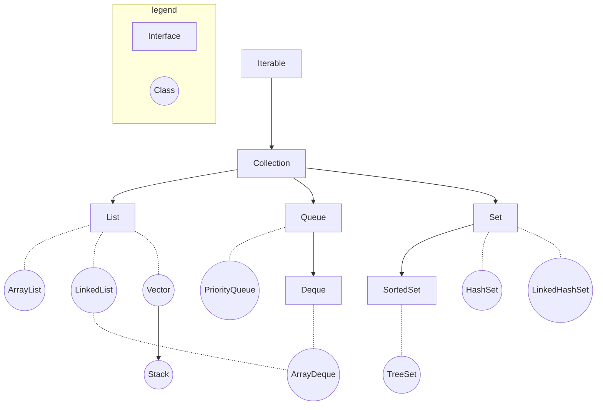
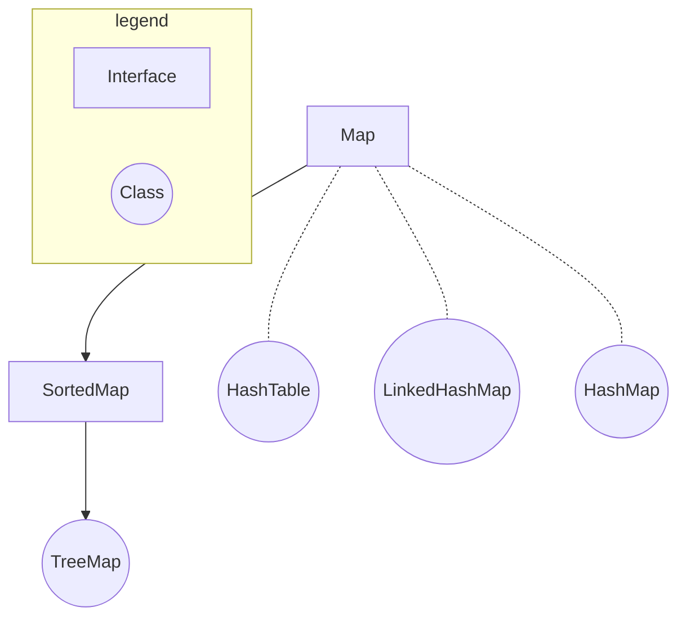

在后续文中所有的示例代码都以引入了`java.util`包为前提，即：
```java
import java.util.*;
```

# 整体框架
Java的集合框架分为两个体系：
- 基于**Collection接口**。Collection接口继承自Iterable接口，这说明其子类均可以实现**遍历操作**。

- 基于**Map接口**。子类均可以实现**键值对操作**，键不可重复。


## Collection框架


## Map框架


# Collection
Collection接口包含三个子接口：
- [List](#list)
- [Queue](#queue)
- [Set](#set)

## List
特点：元素**有序**，**可重复**。包含四个子类：
- [ArrayList](#arraylist)
- [LinkedList](#linkedlist)
- [Vector](#vector)
- [Stack](#stack)

### ArrayList
- 基于数组实现
- 线程不安全
- **查找快**，**增删慢**

其与后续提到的链表（LinkedList）使用方法类似，区别在于ArrayList的查找与修改操作效率更高，适合**需要频繁访问或修改列表中某一元素**时使用。

#### 构造方法
```java
ArrayList<E> objectName = new ArrayList<>();
```

#### 常用方法
| 方法 | 描述 |
| --- | --- |
| `add(int index, Object element)` | 将元素**插入**到指定索引处，默认为末尾 |
| `remove(int index)` <br> `remove(Object element)` | **删除**指定索引处的元素 <br> **删除**指定元素|
| `get(int index)` | **查询**指定索引处的元素 |
| `set(int index, Object element)` | **修改**指定索引处的元素 |
| `sort()` | 升序排序 |
| `size()` | 返回元素数量 |
| `subList(int start, int end)` | 返回指定子列表，**左闭右开** |

代码示例：
```java
import java.util.*;

public class arraylist {
    public static void main(String[] args){
        /* initialize */
        ArrayList<String> S = new ArrayList<>();
        String[] s = {"hello", "good", "bad", "happy", "art"};
        for (String element: s){
            S.add(element);
        }
        print("initialize", S);

        /* add */
        S.add("code");
        print("default add", S);
        S.add(0, "ok");
        print("add using index 0", S);

        /* remove */
        S.remove("hello");
        print("remove 'hello'", S);
        S.remove(3);
        print("remove using index 3", S);

        /* get */
        print("get index 2", S.get(2));

        /* set */
        S.set(3, "science");
        print("set", S);

        /* sort */
        S.sort(null);
        print("sort", S);

        /* size */
        print("size", S.size());

        /* subList */
        print("subList", S.subList(1, 4));
    }

    public static void print(String prompt, ArrayList<String> x){
        System.out.println(String.format("%-30s %-20s", prompt, " S = " + x));
    }

    public static void print(String prompt, String x){
        System.out.println(String.format("%-30s %-20s", prompt, " string = " + x));
    }

    public static void print(String prompt, int x){
        System.out.println(String.format("%-30s %-20s", prompt, " size = " + x));
    }
    
    public static void print(String prompt, List<String> x){
        System.out.println(String.format("%-30s %-20s", prompt, " sublist = " + x));
    }
}
```
输出：
```
initialize                      S = [hello, good, bad, happy, art]
default add                     S = [hello, good, bad, happy, art, code]
add using index 0               S = [ok, hello, good, bad, happy, art, code]
remove 'hello'                  S = [ok, good, bad, happy, art, code]
remove using index 3            S = [ok, good, bad, art, code]
get index 2                     string = bad       
set                             S = [ok, good, bad, science, code]
sort                            S = [bad, code, good, ok, science]
size                            size = 5           
subList                         sublist = [code, good, ok]
```

### LinkedList
- 基于链表实现
- 线程不安全
- **查找慢**，**增删快**

链表（LinkedList）由**节点**组成，每一个节点中存储该节点的值与相邻（根据不同情况）节点的地址。链表分为以下两类：
- **单向链表**，包含：
  - 当前节点的值
  - 下一个节点的地址
- **双向链表**，包含：
  - 当前节点的值
  - 下一个节点的地址
  - 上一个节点的地址

其使用方法与ArrayList类似，只不过链表的增删操作效率更高，而查找与修改的操作效率较低。所以当需要**频繁地在列表中进行增删操作**时使用链表更合适。

#### 构造方法
- 普通初始化
    ```java
    LinkedList<E> list = new LinkedList<>();
    ```
- 使用其他集合创建
    ```java
    LinkedList<E> list = new LinkedList<>(Collection<E> c);
    ```
    例：
    ```java
    import java.util.*;

    public class linkedlist {
        public static void main(String[] args){ 
            ArrayList<Integer> nums = createArrayList(1, 2, 3, 4, 5);
            LinkedList<Integer> list2 = new LinkedList<>(nums);
            print("initialization with other collections", list2);
        }

        public static ArrayList<Integer> createArrayList(Integer... nums){
            ArrayList<Integer> res = new ArrayList<>();
            res.addAll(Arrays.asList(nums));
            return res;
        }

        public static void print(String prompt, LinkedList<Integer> list){
            System.out.println(String.format("%-50s %-30s", prompt, "list = " + list));
        }
    }
    ```
    输出：
    ```
    initialization with other collections              list = [1, 2, 3, 4, 5]
    ```

#### 常用方法
| 方法 | 描述 |
| --- | --- |
| `add(int index, Object element)` |  |
| `addFirst(Object element)` |  |
| `addLast(Object element)` |  |
| `` |  |
| `` |  |
| `` |  |


### Vector
- 基于数组实现
- 线程安全
- 属于遗留类，不常用（常用ArrayList）

#### 构造方法
支持四种构造方法：
- 创建一个默认的向量，默认容量为**10**
    ```java
    Vector<Integer> v1 = new Vector<>();
    System.out.println("v1 capacity: " + v1.capacity());
    ```
    输出：
    ```
    v1 capacity: 10
    ```
- 创建一个指定容量的向量
    ```java
    Vector<Integer> v2 = new Vector<>(20);
    System.out.println("v2 capacity: " + v2.capacity());
    ```
    输出：
    ```
    v2 capacity: 20
    ```
- 创建一个指定容量和**增量**的向量，增量指的是当数组容量不足时自动补足的容量大小
    ```java
    Vector<Integer> v3 = new Vector<>(2, 3);
    for (int i = 0; i < 6; i++){
        v3.add(1);
        System.out.println("i = " + i + "\t\tv3 capacity: " + v3.capacity());
    }
    ```
    输出：
    ```
    i = 0		v3 capacity: 2
    i = 1		v3 capacity: 2
    i = 2		v3 capacity: 5
    i = 3		v3 capacity: 5
    i = 4		v3 capacity: 5
    i = 5		v3 capacity: 8
    ```
- 创建一个包含某个集合中所有元素的向量
    ```java
    ArrayList<Integer> nums = new ArrayList<>(3);
    nums.add(1);
    nums.add(2);
    Vector<Integer> v = new Vector<>(nums);
    System.out.println("v = " + v);
    ``` 
    输出：
    ```
    v = [1, 2]
    ```

#### 常用方法
| 方法 | 描述 |
|---|---|
| `add(int index, Object element)` | 向指定位置插入指定元素 |
| `add(Object element)` | 将指定元素添加至向量末尾 |
| `capacity()` | 返回向量的当前容量 |
| `contains(Object element)` | 判断向量是否包含指定元素 |
| `get(int index)` | 返回指定索引处的元素，与`` |
| `equals(Object o)` | 比较指定对象是否与此向量相等 |
| `remove(int index)` | 移除向量中指定索引的元素 |
| `subList(int start, int end)` | 返回指定索引区间（**左闭右开**）的元素 |

代码示例：
```java
import java.util.*;

public class vector{
    public static void main(String[] args){
        /* add */
        Vector<Integer> v4 = new Vector<>();
        for (int i = 0; i < 8; i++){
            v4.add(i);
        }
        System.out.println(String.format("%-60s %10s", "v4 = " + v4, "capacity = " + v4.capacity()));
        
        /* add with index */
        for (int i = 0; i < 5; i++){
            v4.add(1, 100);
            System.out.println(String.format("%-60s %10s", "v4 = " + v4, "capacity = " + v4.capacity()));
        }
        
        /* contains */
        System.out.println("v4 contains 98: " + v4.contains(98));
        System.out.println("v4 contains 1: " + v4.contains(1));

        /* get */
        System.out.println("v4[2] = " + v4.get(2));

        /* remove */
        for (int i = 0; i < 6; i++){
            v4.remove(0);
        }
        System.out.println("v4 = " + v4);

        /* subList */
        System.out.println("v4[2:6] = " + v4.subList(2, 6));
    }
}
```
输出:
```
v4 = [0, 1, 2, 3, 4, 5, 6, 7]                                capacity = 10
v4 = [0, 100, 1, 2, 3, 4, 5, 6, 7]                           capacity = 10
v4 = [0, 100, 100, 1, 2, 3, 4, 5, 6, 7]                      capacity = 10
v4 = [0, 100, 100, 100, 1, 2, 3, 4, 5, 6, 7]                 capacity = 20
v4 = [0, 100, 100, 100, 100, 1, 2, 3, 4, 5, 6, 7]            capacity = 20
v4 = [0, 100, 100, 100, 100, 100, 1, 2, 3, 4, 5, 6, 7]       capacity = 20
v4 contains 98: false
v4 contains 1: true
v4[2] = 100
v4 = [1, 2, 3, 4, 5, 6, 7]
v4[2:6] = [3, 4, 5, 6]
```

### Stack


## Queue

### PriorityQueue

### Deque


## Set

### Hashset

### LinkedHashSet

### SortedSet

### TreeSet


# Map

## SortedMap

### TreeMap

## HashTable

## LinkedHashMap

## HashMap


# 参考
- [https://forthe77.github.io/2019/03/28/collection-frame-diagram/](https://forthe77.github.io/2019/03/28/collection-frame-diagram/)
