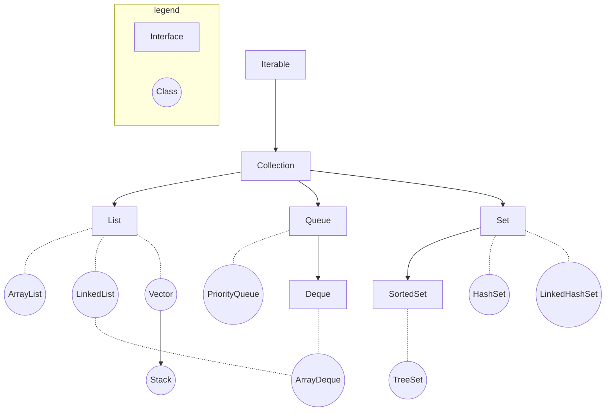
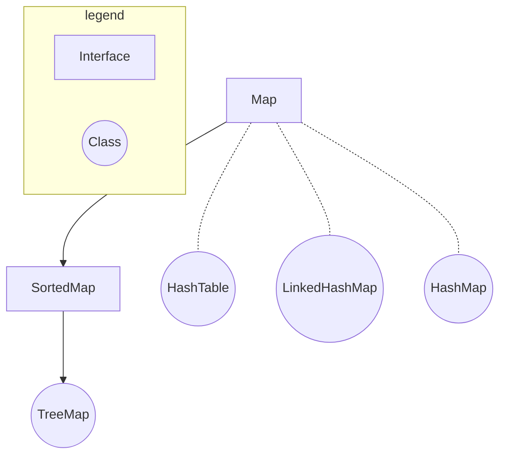

在后续文中所有的示例代码都以引入了`java.util`包为前提，即：
```java
import java.util.*;
```

# 整体框架
Java的集合框架分为两个体系：
- 基于**Collection接口**。Collection接口继承自Iterable接口，这说明其子类均可以实现**遍历操作**。

- 基于**Map接口**。子类均可以实现**键值对操作**，键不可重复。


## Collection框架


## Map框架


# Collection
Collection接口包含三个子接口：
- [List](#list)
- [Queue](#queue)
- [Set](#set)

## List
特点：元素**有序**，**可重复**。包含以下几个常用的实现类：
- [ArrayList](#arraylist)
- [LinkedList](#linkedlist)
- [Vector](#vector)
- [Stack](#stack)

### ArrayList
- 基于数组实现
- 线程不安全
- **查找快**，**增删慢**

其与后续提到的链表（LinkedList）使用方法类似，区别在于ArrayList的查找与修改操作效率更高，适合**需要频繁访问或修改列表中某一元素**时使用。

#### 构造方法
```java
ArrayList<E> objectName = new ArrayList<>();
```

#### 常用方法
| 方法 | 描述 |
| --- | --- |
| `add(int index, E e)` | 将元素**插入**到指定索引处，默认为末尾 |
| `remove(int index)` <br> `remove(E e)` | **删除**指定索引处的元素 <br> **删除**指定元素|
| `get(int index)` | **查询**指定索引处的元素 |
| `set(int index, E e)` | **修改**指定索引处的元素 |
| `sort()` | 升序排序 |
| `size()` | 返回元素数量 |
| `subList(int start, int end)` | 返回指定子列表，**左闭右开** |

代码示例：
```java
import java.util.*;

public class arraylist {
    public static void main(String[] args){
        /* initialize */
        ArrayList<String> S = new ArrayList<>();
        String[] s = {"hello", "good", "bad", "happy", "art"};
        for (String element: s){
            S.add(element);
        }
        print("initialize", S);

        /* add */
        S.add("code");
        print("default add", S);
        S.add(0, "ok");
        print("add using index 0", S);

        /* remove */
        S.remove("hello");
        print("remove 'hello'", S);
        S.remove(3);
        print("remove using index 3", S);

        /* get */
        print("get index 2", S.get(2));

        /* set */
        S.set(3, "science");
        print("set", S);

        /* sort */
        S.sort(null);
        print("sort", S);

        /* size */
        print("size", S.size());

        /* subList */
        print("subList", S.subList(1, 4));
    }

    public static void print(String prompt, ArrayList<String> x){
        System.out.println(String.format("%-30s %-20s", prompt, " S = " + x));
    }

    public static void print(String prompt, String x){
        System.out.println(String.format("%-30s %-20s", prompt, " string = " + x));
    }

    public static void print(String prompt, int x){
        System.out.println(String.format("%-30s %-20s", prompt, " size = " + x));
    }
    
    public static void print(String prompt, List<String> x){
        System.out.println(String.format("%-30s %-20s", prompt, " sublist = " + x));
    }
}
```
输出：
```
initialize                      S = [hello, good, bad, happy, art]
default add                     S = [hello, good, bad, happy, art, code]
add using index 0               S = [ok, hello, good, bad, happy, art, code]
remove 'hello'                  S = [ok, good, bad, happy, art, code]
remove using index 3            S = [ok, good, bad, art, code]
get index 2                     string = bad       
set                             S = [ok, good, bad, science, code]
sort                            S = [bad, code, good, ok, science]
size                            size = 5           
subList                         sublist = [code, good, ok]
```

### LinkedList
- 基于链表实现
- 线程不安全
- **查找慢**，**增删快**

链表（LinkedList）由**节点**组成，每一个节点中存储该节点的值与相邻（根据不同情况）节点的地址。链表分为以下两类：
- **单向链表**，包含：
  - 当前节点的值
  - 下一个节点的地址
- **双向链表**，包含：
  - 当前节点的值
  - 下一个节点的地址
  - 上一个节点的地址

其使用方法与ArrayList类似，只不过链表的增删操作效率更高，而查找与修改的操作效率较低。所以当需要**频繁地在列表中进行增删操作**时使用链表更合适。

#### 构造方法
- 普通初始化
    ```java
    LinkedList<E> list = new LinkedList<>();
    ```
- 使用其他集合创建
    ```java
    LinkedList<E> list = new LinkedList<>(Collection<E> c);
    ```
    例：
    ```java
    import java.util.*;

    public class linkedlist {
        public static void main(String[] args){ 
            ArrayList<Integer> nums = createArrayList(1, 2, 3, 4, 5);
            LinkedList<Integer> list2 = new LinkedList<>(nums);
            print("initialization with other collections", list2);
        }

        public static ArrayList<Integer> createArrayList(Integer... nums){
            ArrayList<Integer> res = new ArrayList<>();
            res.addAll(Arrays.asList(nums));
            return res;
        }

        public static void print(String prompt, LinkedList<Integer> list){
            System.out.println(String.format("%-50s %-30s", prompt, "list = " + list));
        }
    }
    ```
    输出：
    ```
    initialization with other collections              list = [1, 2, 3, 4, 5]
    ```

#### 常用方法
| 方法 | 描述 |
| --- | --- |
| `add(E e)` <br> `add(int index, E e)` | 向链表**末尾**添加元素，添加成功返回`true`，反之返回`false` <br> 向**指定位置**添加元素，**无返回值**，出错**会抛出异常** |
| `addFirst(E e)` <br> `addLast(E e)` | 将指定元素添加至链表头部，**无返回值**，出错**会抛出异常** <br> 将指定元素添加至链表尾部，**无返回值**，出错**会抛出异常** |
| `remove(Object o)` <br> `remove(int index)` | 删除指定元素，删除成功返回`true`，反之返回`false` <br> 删除指定位置元素**并返回**，出错**会抛出异常** |
| `removeFirst()` <br> `removeLast()` | 删除**并返回**第一个元素，出错**会抛出异常** <br> 删除**并返回**最后一个元素，出错**会抛出异常** |
| `get(int index)` <br> `getFirst()` <br> `getLast()` | 获取指定位置元素，出错**会抛出异常** <br> 获取链表第一个元素，出错**会抛出异常** <br> 获取链表最后一个元素，出错**会抛出异常** |
| `set(int index, E e)` | 将指定位置元素替换 |
| `size()` | 返回链表元素个数 |

代码示例：
```java
/* add */
list2.add(5, 6);
print("add", list2);
list2.addFirst(0);
print("add first 0", list2);
list2.addLast(7);
print("add last 7", list2);

/* remove */
list2.remove(2);
print("remove element in index 2", list2);
list2.removeFirst();
print("remove first", list2);
list2.removeLast();
print("remove last", list2);

/* get */
print("get index 3", list2.get(3));
print("get first", list2.getFirst());
print("get last", list2.getLast());

/* set */
list2.set(2, 10);
print("set element in index 2 to 10", list2);

/* size */
print("size of list", list2.size());
```
输出：
```
add                                                list = [1, 2, 3, 4, 5, 6]     
add first 0                                        list = [0, 1, 2, 3, 4, 5, 6]  
add last 7                                         list = [0, 1, 2, 3, 4, 5, 6, 7]
remove element in index 2                          list = [0, 1, 3, 4, 5, 6, 7]  
remove first                                       list = [1, 3, 4, 5, 6, 7]     
remove last                                        list = [1, 3, 4, 5, 6]        
get index 3                                        num = 5                       
get first                                          num = 1                       
get last                                           num = 6                       
set element in index 2 to 10                       list = [1, 3, 10, 5, 6]       
size of list                                       num = 5  
```


### Vector
- 基于数组实现
- 线程安全
- 属于遗留类，不常用（常用ArrayList）

#### 构造方法
支持四种构造方法：
- 创建一个默认的向量，默认容量为**10**
    ```java
    Vector<Integer> v1 = new Vector<>();
    System.out.println("v1 capacity: " + v1.capacity());
    ```
    输出：
    ```
    v1 capacity: 10
    ```
- 创建一个指定容量的向量
    ```java
    Vector<Integer> v2 = new Vector<>(20);
    System.out.println("v2 capacity: " + v2.capacity());
    ```
    输出：
    ```
    v2 capacity: 20
    ```
- 创建一个指定容量和**增量**的向量，增量指的是当数组容量不足时自动补足的容量大小
    ```java
    Vector<Integer> v3 = new Vector<>(2, 3);
    for (int i = 0; i < 6; i++){
        v3.add(1);
        System.out.println("i = " + i + "\t\tv3 capacity: " + v3.capacity());
    }
    ```
    输出：
    ```
    i = 0		v3 capacity: 2
    i = 1		v3 capacity: 2
    i = 2		v3 capacity: 5
    i = 3		v3 capacity: 5
    i = 4		v3 capacity: 5
    i = 5		v3 capacity: 8
    ```
- 创建一个包含某个集合中所有元素的向量
    ```java
    ArrayList<Integer> nums = new ArrayList<>(3);
    nums.add(1);
    nums.add(2);
    Vector<Integer> v = new Vector<>(nums);
    System.out.println("v = " + v);
    ``` 
    输出：
    ```
    v = [1, 2]
    ```

#### 常用方法
| 方法 | 描述 |
|---|---|
| `add(int index, E e)` | 向指定位置插入指定元素 |
| `add(E e)` | 将指定元素添加至向量末尾 |
| `capacity()` | 返回向量的当前容量 |
| `contains(E e)` | 判断向量是否包含指定元素 |
| `get(int index)` | 返回指定索引处的元素，与`` |
| `equals(Object o)` | 比较指定对象是否与此向量相等 |
| `remove(int index)` | 移除向量中指定索引的元素 |
| `subList(int start, int end)` | 返回指定索引区间（**左闭右开**）的元素 |

代码示例：
```java
import java.util.*;

public class vector{
    public static void main(String[] args){
        /* add */
        Vector<Integer> v4 = new Vector<>();
        for (int i = 0; i < 8; i++){
            v4.add(i);
        }
        System.out.println(String.format("%-60s %10s", "v4 = " + v4, "capacity = " + v4.capacity()));
        
        /* add with index */
        for (int i = 0; i < 5; i++){
            v4.add(1, 100);
            System.out.println(String.format("%-60s %10s", "v4 = " + v4, "capacity = " + v4.capacity()));
        }
        
        /* contains */
        System.out.println("v4 contains 98: " + v4.contains(98));
        System.out.println("v4 contains 1: " + v4.contains(1));

        /* get */
        System.out.println("v4[2] = " + v4.get(2));

        /* remove */
        for (int i = 0; i < 6; i++){
            v4.remove(0);
        }
        System.out.println("v4 = " + v4);

        /* subList */
        System.out.println("v4[2:6] = " + v4.subList(2, 6));
    }
}
```
输出:
```
v4 = [0, 1, 2, 3, 4, 5, 6, 7]                                capacity = 10
v4 = [0, 100, 1, 2, 3, 4, 5, 6, 7]                           capacity = 10
v4 = [0, 100, 100, 1, 2, 3, 4, 5, 6, 7]                      capacity = 10
v4 = [0, 100, 100, 100, 1, 2, 3, 4, 5, 6, 7]                 capacity = 20
v4 = [0, 100, 100, 100, 100, 1, 2, 3, 4, 5, 6, 7]            capacity = 20
v4 = [0, 100, 100, 100, 100, 100, 1, 2, 3, 4, 5, 6, 7]       capacity = 20
v4 contains 98: false
v4 contains 1: true
v4[2] = 100
v4 = [1, 2, 3, 4, 5, 6, 7]
v4[2:6] = [3, 4, 5, 6]
```

### Stack
Stack是**Vector类的子类**，实现了后进先出的栈。其包括了Vector类中定义的所有方法，也定义了一些自己独有的方法，总结如下：
| 方法 | 描述 |
| --- | --- |
| `empty()` | 判断栈是否为空 |
| `peek()` | 查看栈顶对象，**不移除** |
| `pop()` | 弹出栈顶对象并返回 |
| `push(E e)` | 将对象入栈 |
| `search(E e)` | 返回指定元素在栈中的位置，**以1为索引起点** |

代码示例：
```java
import java.util.*;

public class stack {
    public static void main(String[] args){
        /* initialization */
        Stack<Integer> nums = new Stack<>();
        for (int i = 0; i < 10; i++){
            nums.add(i);
        }
        print("initialization", nums);

        /* empty */
        print("is empty", nums.empty());

        /* peek */
        print("peek", nums.peek());
        print("stack after peek", nums);

        /* pop */
        print("pop", nums.pop());
        print("stack after pop", nums);

        /* push */
        nums.push(10);
        print("stack after push", nums);

        /* search */
        print("the index of 5 in the stack", nums.search(5));
    }

    public static void print(String prompt, boolean is_empty){
        System.out.println(String.format("%-30s %-30s", prompt, is_empty));
    }

    public static void print(String prompt, Integer num){
        System.out.println(String.format("%-30s %-30s", prompt, num));
    }

    public static void print(String prompt, Stack<Integer> nums){
        System.out.println(String.format("%-30s %-30s", prompt, nums));
    }
}

```
输出:
```
initialization                 [0, 1, 2, 3, 4, 5, 6, 7, 8, 9]
is empty                       false                         
peek                           9                             
stack after peek               [0, 1, 2, 3, 4, 5, 6, 7, 8, 9]
pop                            9                             
stack after pop                [0, 1, 2, 3, 4, 5, 6, 7, 8]   
stack after push               [0, 1, 2, 3, 4, 5, 6, 7, 8, 10]
the index of 5 in the stack    5  
```

## Queue
特点：元素**有序**，**可重复**。包含以下几个常用的实现类：
- [PriorityQueue](#priorityqueue)
- [ArrayDeque](#arraydeque)
- [LinkedList](#linkedlist)

### PriorityQueue
- 基于二叉堆实现
- 按照入队元素的大小重新排序，最小的元素最先出队列（**最小堆**）
- 默认排序方式为**升序排序**
- 线程不安全

#### 构造方法
```java
PriorityQueue<E> nums = new PriorityQueue<>();
```

#### 常用方法
| 方法类型 | 具体方法 | 描述 |
| --- | --- | --- |
| 添加元素 | `add(E e)` <br> `offer(E e)`  | 向优先队列中添加元素，当队列已满会**报错** <br> 向优先队列中添加元素，当队列已满会**返回**`false` |
| 访问元素 | `element()` <br> `peek()` | 获取队头元素，队列为空时**报错** <br> 获取队头元素，队列为空时**返回**`null` |
| 删除元素 | `remove()` <br> `poll()` | 删除队头元素并返回，队列为空时**报错** <br> 删除队头元素并返回，队列为空时**返回**`null` |
| 其他 | `size()` <br> `contains(E e)` <br> `toArray()` | 返回队列长度 <br> 判断队列中是否包含指定元素 <br> 将队列转化为数组并返回 |

代码示例：
```java
import java.util.*;

public class priorityqueue{
    public static void main(String[] args){
        /* initialization */
        PriorityQueue<Integer> nums = new PriorityQueue<>();

        /* add, offer */
        for (int i = 10; i > 0; i--){
            nums.offer(i);
        }
        print("offer:", nums);
        nums.add(0);
        print("add:", nums);

        /* element, peek */
        print("element(default):", nums.element());
        print("peek(default):", nums.peek());

        /* remove, poll */
        print("remove:", nums.remove());
        print("poll:", nums.poll());

        /* size */
        print("size:", nums.size());

        /* contains */
        print("contains 7:", nums.contains(7));
        print("contains 100:", nums.contains(100));
    }

    public static void print(String prompt, PriorityQueue<Integer> nums){
        System.out.println(String.format("%-30s %-30s", prompt, nums));
    }

    public static void print(String prompt, Object num){
        System.out.println(String.format("%-30s %-30s", prompt, num));
    }

    public static void print(String prompt, boolean contain){
        System.out.println(String.format("%-30s %-30s", prompt, contain));
    }
}
```
输出：
```
offer:                         [1, 2, 5, 4, 3, 9, 6, 10, 7, 8]
add:                           [0, 1, 5, 4, 2, 9, 6, 10, 7, 8, 3]
element(default):              0                             
peek(default):                 0                             
remove:                        0                             
poll:                          1                             
size:                          9                             
contains 7:                    true                          
contains 100:                  false
```

#### 遍历方式
遍历队列的方式：
```java
Iterator<Integer> iter = nums.iterator();
while (iter.hasNext()){
    print("iter:", iter.next());
}
```
输出：
```
iter:                          0                             
iter:                          1                             
iter:                          5                             
iter:                          4                             
iter:                          2                             
iter:                          9                             
iter:                          6                             
iter:                          10                            
iter:                          7                             
iter:                          8                             
iter:                          3
```

#### 比较器（Comparator）
通过使用Comparator，我们可以自定义队列中元素的排序方式。使用时需要创建自定义的比较器类，令其实现Comparator接口，示例如下：
```java
class CustomComparator implements Comparator<Integer>{
    @Override
    public int compare(Integer n1, Integer n2){
        if (n1 > n2){
            return -1;
        }
        else if (n1 == n2){
             return 0;
        }
        else{ 
            return 1;
        }
    }
}
```
这里看到通过Comparator接口实现的自定义类中存在一个`compare`方法，它的作用是用来定义参数的排序方式。更具体地说，这个方法返回一个具有三种可能性的值 **（正、负、零）**，分别代表第一个参数**大于、小于、等于**第二个参数。而这里可以看到当`n1 > n2`时返回负值，说明此时在这个自定义的比较器类中**正常情况下越大的整数会被识别为越小的值**，也即**倒序**排列。将这个自定义的排序方式应用到优先队列中的方式如下：
```java
PriorityQueue<Integer> nums = new PriorityQueue<>(new CustomComparator());
```
此时这个优先队列实际上成为了一个**最大堆**。最后看一下实现的效果：
```java
for (int i = 0; i < 10; i++){
    nums.offer(i);
}
System.out.println(String.format("%-10s %-10s", "nums:", nums));
```
输出：
```
nums:      [9, 8, 5, 6, 7, 1, 4, 0, 3, 2]
```

### ArrayDeque


## Set

### Hashset

### LinkedHashSet

### SortedSet

### TreeSet


# Map

## SortedMap

### TreeMap

## HashTable

## LinkedHashMap

## HashMap


# 参考
- [https://forthe77.github.io/2019/03/28/collection-frame-diagram/](https://forthe77.github.io/2019/03/28/collection-frame-diagram/)
